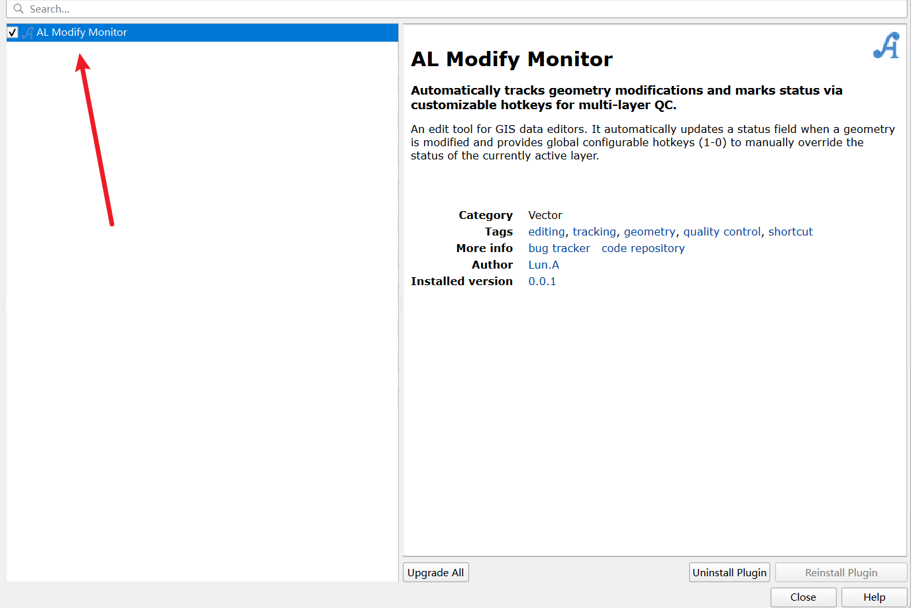
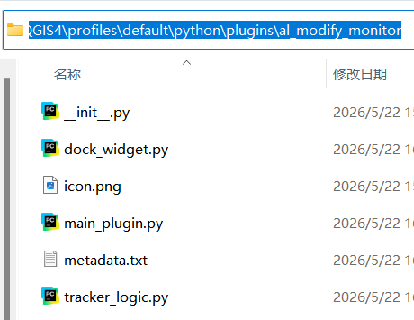
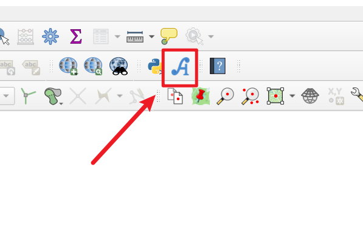
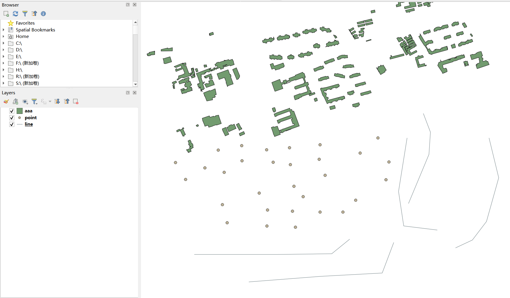
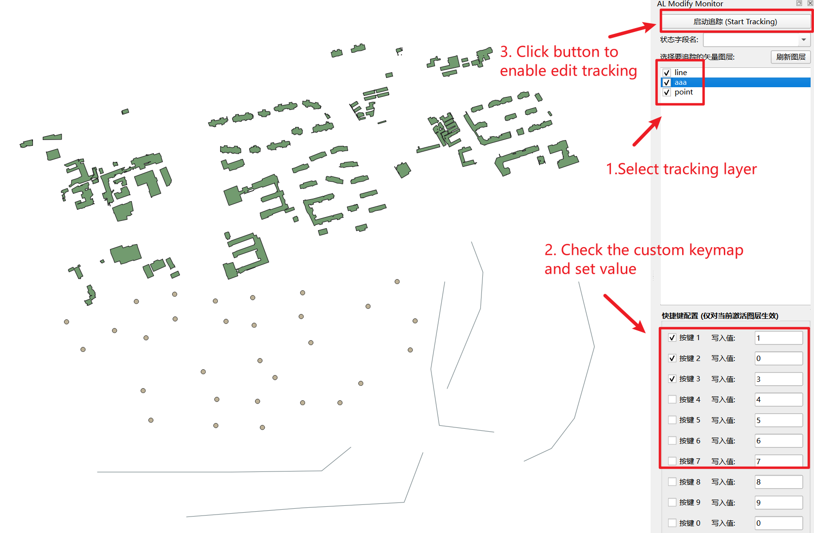
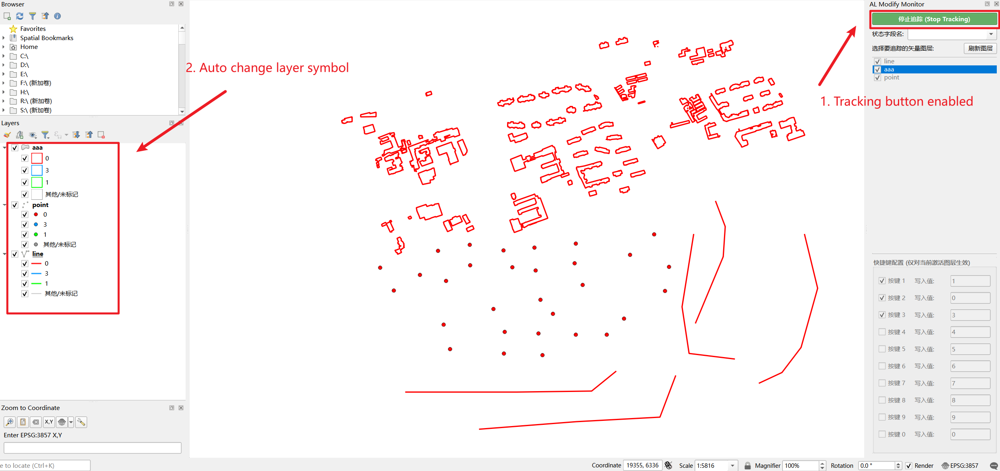
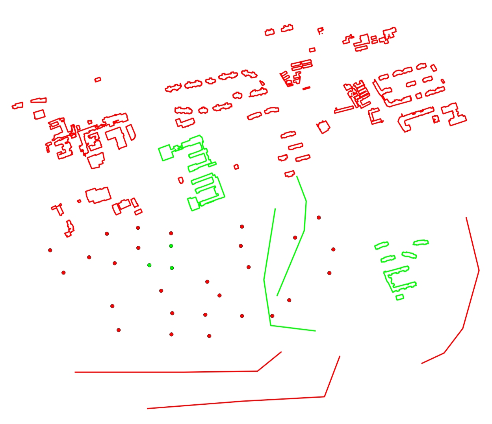
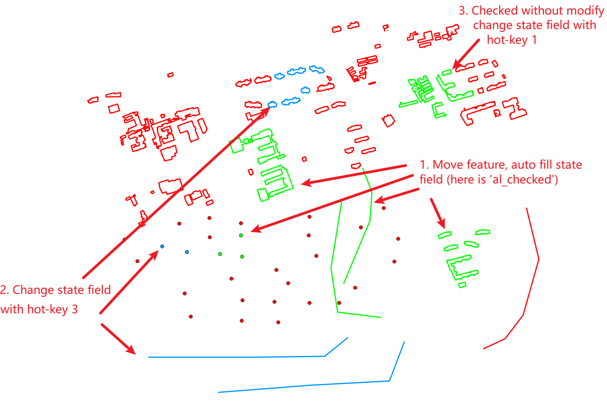

# Usage

本项目是 QGIS 插件，用于监测矢量数据的几何是否被修改，若被修改则自动将状态字段对应记录的值改为 1，几何的监测包括平移、旋转、缩放、顶点编辑等。

为什么会有这个插件？因为我在检测、修正大范围数据时，很容易搞混哪里是已经修改了的，哪里是没有修改了的。通过自己建立字段，每次修改都要手动填充字段值非常麻烦，所以做了这个懒人插件以减轻对那些不得不人工验证或修改大批量数据上的手工量。截止 2026.05.22 是插件第一版（v0.0.1）可能会碰到一些 bug（目前我自己使用还没碰到，但是没有经过长期、大量测试），请在修改时积极保存数据，如果有 bug 不着急可以提 issue，或者你直接改了提 pr，很着急又不想自己改的可以将详情描述清楚发邮件到 517308447@qq.com，我看到且空闲的话会优先进行修复。

&nbsp;

**图层选择**：支持选择单个或多个图层，开始追踪后在 "AL Modify Monitor" 窗口中设置的快捷将将生效，点击对应的快捷键（数字键，不区分小键盘）后会自动向被选择的数据的指定状态字段填充自定义的写入值（在快捷键窗口中设置的值）；

**状态字段**：可以选择任意字段，若不选择任何字段则自动新建 "al_check" 的数值型字段，默认值为 0；

**图层样式**：点击"开启追踪（Start Tracking）"后会检测当前图层是否使用的是简单的 Single Symbol，若是则推测用户希望使用推荐的用法，则会自动将被追踪图层的样式改为 Categorized 并自动填充激活快捷键中对应的值作为独立的样式；

&nbsp;

**插件安装**：

1. 插件市场安装，找到 AL Modify Monitor 插件并安装；

2. 下载源码包并放到 QGIS 插件目录下（如 C:\Users\alun\AppData\Roaming\QGIS\QGIS4\profiles\default\python\plugins\al_modify_monitor）

&nbsp;

**用法推荐**：

1. 安装并激活插件，成功后会自动添加插件图标；

2. 添加矢量图层到当前 QGIS 工程中；

3. 选择图层并激活追踪（不需要选择状态自动，让插件自己去创建）

4. 开始编辑，编辑的过程中，几何被修改的数据会自动变色。默认是应用的状态字段中值为 0 的红色，编辑几何后字段值会被自动设置为 1，颜色也会变成绿色；

5. 当不需要修改几何，但是要将数据设置为 checked 的颜色，就需要使用自定义快捷键来完成，选中数据并通过数字键 1 改为已修改，或者通过数字键3（要激活，我这里已经激活了快捷键1、2、3）来改为值 3；

   

